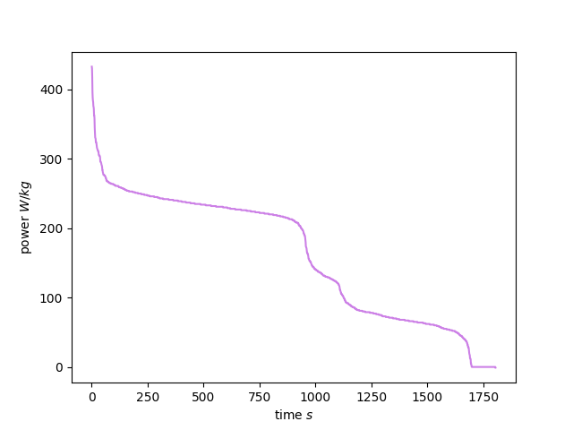

# Programmieren-2-Aufgabe-1: Power Curve Project
(Leonie und Amelie)

This project generates a power‑curve plot using Python and Matplotlib from the given data.


The project uses **PDM** as the package and environment manager to ensure reproducible installations.

---
## Installation with PDM

Make sure PDM is installed:

```bash
pip install pdm   ## in case pdm is not yet installed

pdm venv create
pdm install       ## installs the necessary packages (matplotlib, numpy)


## Run the file: 
 pdm run python power_curve.py


